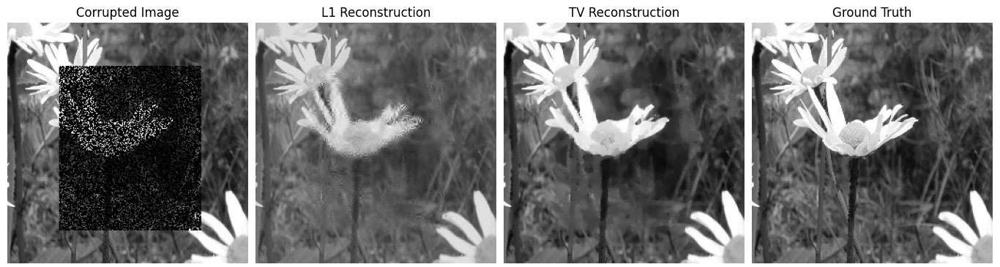
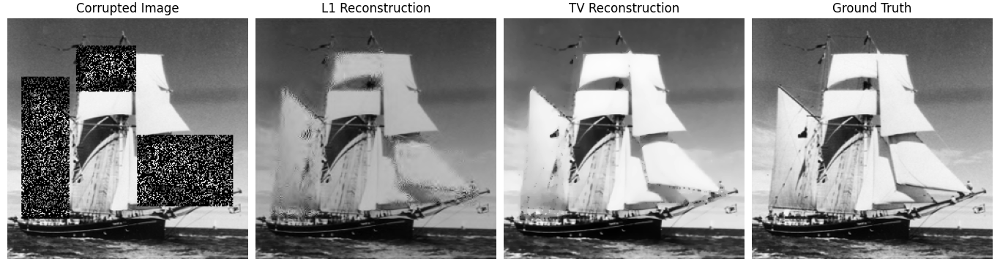

## PRIME: Proximal Regularization for Image Manipulation and Enhancement

## Description
`prime` contains implementations of three proximal gradient methods for Image Restoration, specifically Iterative Shrinkage Thresholding Algorithm (ISTA), Accelerated Proximal Gradient (APGD) and Fast ISTA (FISTA). This is in partial fullfilment for the course E1 260 : Optimization for Machine Learning, January 2023 Term, IISc Bangalore. All the code has been written in [Python 3](https://www.python.org).

## Organisation of the `prime` package
* `./src` contains the following scripts.
    - `01. run.py`
    - `02. compare.py`
    - `03. utility.py`

* `./samples` contains random images from the Imagenet-mini dataset (download from [Kaggle](https://www.kaggle.com/datasets/deeptrial/miniimagenet) and extract to `./data`).

* `./results` contains sample results for a few images

## Sample Results

## Authors
* [Aditya C](mailto:adichand20@gmail.com), Department of Electrical and Communication Engineering, IISc Bangalore.
* [Rajesh Berepalli](mailto:rajeshberepa@iisc.ac.in), Department of Electrical and Communication Engineering, IISc Bangalore.
> *For questions or suggestions, please contact: adichand20@gmail.com or rajeshberepa@iisc.ac.in*
